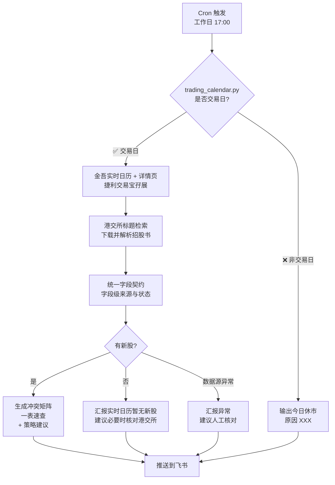

# 📊 hkex-ipo-tracker

汇总港交所（HKEX）正在招股的公司，给港股打新投资者做**资金排期 + 标的筛选 + 热度判断**。

## ✨ 核心特性

- 📅 **资金冲突矩阵**：自动按"招股截止日间隔 < 2 天"分组，识别资金互锁的批次
- 🔍 **字段级来源透明**：金吾基础资料 + 捷利交易宝孖展 + 港交所招股书自动核验；每个字段记录来源 URL、获取时间和处理状态
- 🧾 **权威字段补全**：自动定位披露易招股书，补全绿鞋、基石、A+H、保荐人和募资净额
- 🩺 **链路自查**：区分来源未抓取、文件未找到、原文解析失败、规范化丢失、渲染丢失和来源冲突
- ⏰ **认购倍数时点标注**：必标"截止前 N 天"，未至截止加 `⚠️ 仍会变`
- 📋 **一表速查**：上市日 / 公司 / 截止日 / 公开手数 / 认购倍数 / 绿鞋 / 基石 / A+H
- 🚫 **「无新股」也要汇报**：绝不静默（避免用户错过真实新股）
- 🏖️ **港股交易日判断**：内置 2026 年节假日表，非交易日自动跳过
- ✅ **CI 自动化**：GitHub Actions 自动验证 SKILL.md 格式 / JSON 合法性 / Python 语法

## 🧠 工作流



## 🚀 快速开始

### 1. 直接使用（作为 Codex / OpenClaw Skill）

Codex 用户把仓库目录放到 `~/.codex/skills/`；OpenClaw 用户放到 workspace 的 `skills/`：

```bash
cp -r hkex-ipo-tracker ~/.codex/skills/
# 或：cp -r hkex-ipo-tracker ~/.openclaw/workspace/skills/
```

然后触发关键词即可：

- `港股招股` / `港交所IPO` / `正在招股` / `新股打新`
- `IPO 周报` / `HKEX IPO` / `配发结果` / `孖展`
- `招股期` / `新股中签率` / `孖展倍数` / `回拨`

首次运行安装抓取依赖：

```bash
python3 -m pip install -r requirements.txt
python3 -m playwright install chromium
```

随后一条命令生成实时 Markdown、HTML、原始资料留档和数据审计报告：

```bash
python3 scripts/run_report.py
```

### 2. 单独使用 CLI 工具

```bash
# 检查今天是否港股交易日
python3 scripts/trading_calendar.py

# 检查指定日期
python3 scripts/trading_calendar.py 2026-07-01

# 输出 JSON 格式
python3 scripts/trading_calendar.py 2026-07-01 --json

# 每日 IPO 例行检查
python3 scripts/daily_check.py

# 实时抓取、港交所补全并分别生成报告
python3 scripts/scrape_jinwucj.py --output scraped_ipos.json --raw-dir raw/jinwu
python3 scripts/fetch_hkex_official.py --input scraped_ipos.json --output fresh_ipos.json --raw-dir raw/hkex
python3 scripts/generate_report.py --input fresh_ipos.json --output ipo_report.md
python3 scripts/generate_visual.py --input fresh_ipos.json --output ipo_report.html
python3 scripts/audit_pipeline.py --input fresh_ipos.json --scraped scraped_ipos.json --report ipo_report.md --output-json data_audit.json --output-md data_audit.md

# 冲突矩阵计算（通过 stdin 喂 JSON）
python3 scripts/parse_conflict_matrix.py <<'EOF'
[
  {"name": "新股A", "code": "01000", "closing": "2026-06-16"},
  {"name": "新股B", "code": "02000", "closing": "2026-06-17"},
  {"name": "新股C", "code": "03000", "closing": "2026-06-23"}
]
EOF
```

## 📊 冲突矩阵示例

按"招股截止日间隔 < 2 天 = 资金冲突"识别：

| 截止日 | 6/16 | 6/17 | 6/18 | 6/23 |
|---|:---:|:---:|:---:|:---:|
| 6/16 | — | 🔴 1天 | 🟢 2天 | 🟢 7天 |
| 6/17 | 🔴 | — | 🔴 1天 | 🟢 6天 |
| 6/18 | 🟢 | 🔴 | — | 🟢 5天 |
| 6/23 | 🟢 | 🟢 | 🟢 | — |

> **解读**：6/16、6/17、6/18 三个截止日互相纠缠（因为 6/16↔6/17 冲突、6/17↔6/18 冲突），构成**超级冲突组**。6/23 独立。

**实战含义**（资金回流周期 T+2）：
- 6/16 截止的 → 资金 6/18 解冻 → 刚够 6/18 截止的仙工/麦科
- 6/17 截止的 → 资金 6/19 解冻 → **完全错过 6/18 截止的仙工/麦科**（最大痛点）
- 6/18 截止的 → 资金 6/22 解冻 → 来不及再打新

## 📋 一表速查示例

| 上市日 | 公司 | 代码 | 截止日 | 距截止 | 全球发售 | 公开手数 | 认购倍数 | 绿鞋 | 基石 | A+H |
|---|---|---|---|:---:|---|:---:|---|:---:|:---:|:---:|
| 6/22 | 海清智元 | 01392 | 6/16 ✅已截止 | 0 | 8,516 万 | 1.7 万手 | 213.87 倍 🟢 | ❌ | ❌ | ❌ |
| 6/23 | 星源材质 | 06067 | 6/17 ⏰今天 | 0 | 1.50 亿 | 3.0 万手 | 496.48 倍 🟡 | ❌ | ✅ 富国/广发 | ✅ A |
| 6/23 | 华健未来-B | 06132 | 6/17 ⏰今天 | 0 | 8,262 万 | 1.4 万手 | 602.94 倍 🟡 | ✅ 15% | ✅ 睿远/凯博 | ❌ |
| 6/24 | 仙工智能 | 06106 | 6/18 | 1 | 1,050 万 | 1.1 万手 | 162.77 倍 🟠 | ✅ 15% | ✅ 高瓴 | ❌ |
| 6/24 | 麦科医药-B | 02335 | 6/18 | 1 | 5,805 万 | 2.9 万手 | 13.85 倍 🟠 | ✅ 15% | ✅ 云顶新耀 | ❌ |
| 6/26 | 领益智造 | 01688 | 6/23 🆕 | 6 | 8.12 亿 | 12.3 万手 | 暂无孖展 ⚫ | ✅ 15% | ✅ 广发 31.89亿 | ✅ A |

> **认购倍数可信度**：
> - 🟢 接近最终（已截止，配发结果待出）
> - 🟡 今日仍变（截止前 1 天）
> - 🟠 仍有变数（截止前 2 天+）
> - ⚫ N/A（刚启动，暂无孖展）

## 📁 目录结构

```
hkex-ipo-tracker/
├── SKILL.md                          # Codex 主工作流
├── requirements.txt                  # Playwright + pypdf 依赖
├── README.md                         # 本文件
├── LICENSE                           # MIT License
├── .gitignore
├── .github/
│   └── workflows/
│       └── ci.yml                    # GitHub Actions CI
├── references/
│   ├── data-sources.md               # 6 个数据源抓取指南
│   ├── data-quality.md               # 字段来源状态与链路自查规则
│   ├── ipo-fields.md                 # 字段定义 + 计算公式
│   ├── ipo-mechanics.md              # 港股 IPO 机制（回拨/绿鞋/基石/FINI）
│   ├── holidays_2026.json            # 2026 年港股休市日
│   └── sample-data.json              # 模板数据
└── scripts/
    ├── run_report.py                 # 一键实时报告
    ├── ipo_schema.py                 # 统一字段与评分契约
    ├── scrape_jinwucj.py             # Playwright 实时抓取
    ├── fetch_hkex_official.py         # 港交所招股书发现与字段补全
    ├── audit_pipeline.py              # 字段级数据链路自查
    ├── generate_report.py            # Markdown 报告
    ├── generate_visual.py            # HTML 报告
    ├── trading_calendar.py           # 港股交易日判断
    ├── daily_check.py                # 每日例行检查（多源验证）
    ├── parse_conflict_matrix.py      # 冲突矩阵计算
    └── fetch_active_ipos.py          # mmx-cli 抓取脚本
```

## 🔧 数据源

| 源 | 用途 | 优先级 |
|---|---|---|
| 智通财经 | 每日孖展统计 | ⭐⭐⭐ 主源 |
| 金吾资讯 ([ipo.jinwucj.com](https://ipo.jinwucj.com/)) | 招股概况一览 | ⭐⭐⭐ |
| 港交所披露易 ([hkexnews.hk](https://www.hkexnews.hk/)) | 招股章程 / 配发结果 | ⭐⭐⭐⭐ 权威 |
| LiveReport（雪球） | 一手中签率 | ⭐⭐ |
| 格隆汇 | 公司公告 | ⭐⭐ |
| A 股行情 | A+H 比价 | ⭐ |

## ⚙️ 依赖

- Python 3.9+
- Playwright + Chromium（`pip install -r requirements.txt && playwright install chromium`）
- **搜索后端**（任选其一）：
  - `agent_native`：无需额外依赖，由 Codex / Claude / GPT agent 原生搜索（默认）
  - `mmx`：MiniMax mmx CLI（`pip install mmx-cli`）
  - `custom`：任何支持命令行的搜索工具，通过 `CUSTOM_SEARCH_CMD` 配置

环境变量 `SEARCH_PROVIDER` 选择后端，默认 `agent_native`。

## 📅 维护

- 每年 12 月底前搜索「次年 港股 交易日 安排」更新 `references/holidays_YYYY.json`
- 重阳节日期需以港交所官方公告为准（基于农历推算）

## 🤝 贡献

欢迎 PR！流程：
1. Fork 仓库
2. 创建分支 (`git checkout -b feature/awesome-feature`)
3. 提交修改 (`git commit -m 'Add some feature'`)
4. 推送到分支 (`git push origin feature/awesome-feature`)
5. 创建 Pull Request

CI 会自动验证 SKILL.md 格式、JSON 合法性和 Python 语法。

## 📜 License

MIT License — 详见 [LICENSE](./LICENSE)


## 📌 港股通纳入分析 (v4.1.2)

非A+H股在活跃表中会显示港股通纳入展望，基于以下客观规则计算：

### 纳入条件

参考来源：恒生指数公司《指数编算细则》、港交所《港股通纳入条件》

| 条件 | 说明 |
|---|---|
| 恒生综指成分股 | LargeCap/MidCap 自动纳入; SmallCap 需日均市值 >= 50亿港元 |
| 上市时间 | 新上市需等待下次季度检讨（2/5/8/11月）后生效 |
| Fast Entry | 市值排名恒生综指前10%可快速纳入 |
| 排除项 | -S(第二上市)标记、外国公司DRS、停牌状态 |

### 免责声明

> 港股通纳入分析基于公开规则客观计算，仅供参考，不构成投资建议。实际纳入以港交所正式公告为准。恒生指数公司保留季度检讨的最终决定权。

### 参考链接
- 恒生指数公司：https://www.hsi.com.hk/
- 港交所 Stock Connect：https://www.hkex.com.hk/Mutual-Market/Stock-Connect/

## ⚠️ 免责声明

本工具仅供信息汇总和学习使用，**不构成任何投资建议**。打新有风险，投资需谨慎。请独立判断并自负盈亏。


## v4.x 新增模块 (2026-06-22)

| 模块 | 脚本 | 说明 |
|---|---|---|
| A+H 折价分析 | calc_ah_discount.py | A+H 第二上市折价率自动计算 |
| 5 维风险评分 | risk_score.py | 基石30%+题材20%+估值20%+热度15%+风险15% |
| 资金排期助手 | funding_scheduler.py | 按可用资金+风险偏好分配打新组合 |
| 历史首日预测 | historical_first_day.py | 332只新股数据驱动的首日涨幅预测 |
| 配发追踪 | allotment_tracker.py | 含套路拨检测(公开>=100x但最终仅10%) |
| 回拨计算 | clawback_calculator.py | 18A/18C重新分配+标准回拨 |

```bash
python3 scripts/e2e_test.py
python3 -m unittest discover -s tests -v
```
