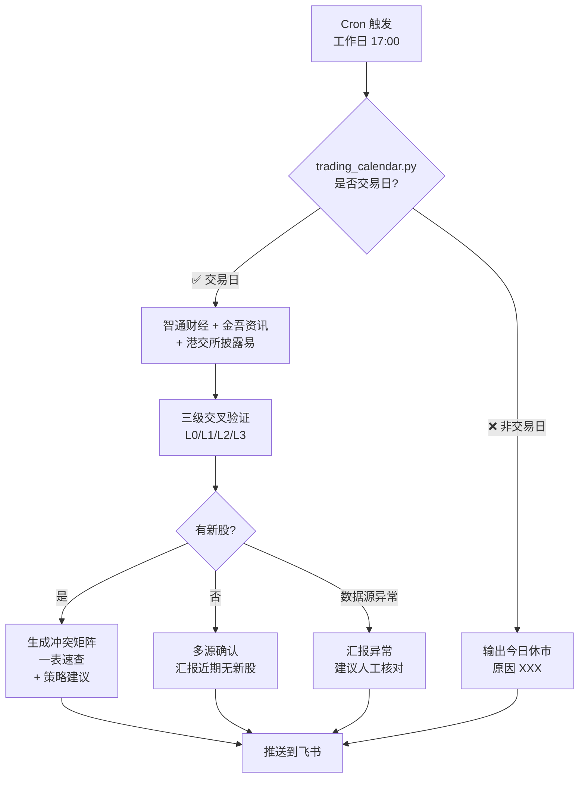

# 📊 hkex-ipo-tracker

汇总港交所（HKEX）正在招股的公司，给港股打新投资者做**资金排期 + 标的筛选 + 热度判断**。

## ✨ 核心特性

- 📅 **资金冲突矩阵**：自动按"招股截止日间隔 < 2 天"分组，识别资金互锁的批次
- 🔍 **多源交叉验证**：智通财经 + 金吾资讯 + 港交所披露易三源校验，避免"无新股"误报
- ⏰ **认购倍数时点标注**：必标"截止前 N 天"，未至截止加 `⚠️ 仍会变`
- 📋 **一表速查**：上市日 / 公司 / 截止日 / 公开手数 / 认购倍数 / 绿鞋 / 基石 / A+H
- 🚫 **「无新股」也要汇报**：绝不静默（避免用户错过真实新股）
- 🏖️ **港股交易日判断**：内置 2026 年节假日表，非交易日自动跳过
- ✅ **CI 自动化**：GitHub Actions 自动验证 SKILL.md 格式 / JSON 合法性 / Python 语法

## 🧠 工作流



## 🚀 快速开始

### 1. 直接使用（作为 OpenClaw Skill）

把这个目录放到你的 OpenClaw workspace 的 `skills/` 目录下：

```bash
cp -r hkex-ipo-tracker ~/.openclaw/workspace/skills/
```

然后触发关键词即可：

- `港股招股` / `港交所IPO` / `正在招股` / `新股打新`
- `IPO 周报` / `HKEX IPO` / `配发结果` / `孖展`
- `招股期` / `新股中签率` / `孖展倍数` / `回拨`

### 2. 单独使用 CLI 工具

```bash
# 检查今天是否港股交易日
python3 scripts/trading_calendar.py

# 检查指定日期
python3 scripts/trading_calendar.py 2026-07-01

# 输出 JSON 格式
python3 scripts/trading_calendar.py 2026-07-01 --json

# 每日 IPO 例行检查
python3 scripts/daily_check.py

# 冲突矩阵计算（通过 stdin 喂 JSON）
python3 scripts/parse_conflict_matrix.py <<'EOF'
[
  {"name": "新股A", "code": "01000", "closing": "2026-06-16"},
  {"name": "新股B", "code": "02000", "closing": "2026-06-17"},
  {"name": "新股C", "code": "03000", "closing": "2026-06-23"}
]
EOF
```

## 📊 冲突矩阵示例

按"招股截止日间隔 < 2 天 = 资金冲突"识别：

| 截止日 | 6/16 | 6/17 | 6/18 | 6/23 |
|---|:---:|:---:|:---:|:---:|
| 6/16 | — | 🔴 1天 | 🟢 2天 | 🟢 7天 |
| 6/17 | 🔴 | — | 🔴 1天 | 🟢 6天 |
| 6/18 | 🟢 | 🔴 | — | 🟢 5天 |
| 6/23 | 🟢 | 🟢 | 🟢 | — |

> **解读**：6/16、6/17、6/18 三个截止日互相纠缠（因为 6/16↔6/17 冲突、6/17↔6/18 冲突），构成**超级冲突组**。6/23 独立。

**实战含义**（资金回流周期 T+2）：
- 6/16 截止的 → 资金 6/18 解冻 → 刚够 6/18 截止的仙工/麦科
- 6/17 截止的 → 资金 6/19 解冻 → **完全错过 6/18 截止的仙工/麦科**（最大痛点）
- 6/18 截止的 → 资金 6/22 解冻 → 来不及再打新

## 📋 一表速查示例

| 上市日 | 公司 | 代码 | 截止日 | 距截止 | 全球发售 | 公开手数 | 认购倍数 | 绿鞋 | 基石 | A+H |
|---|---|---|---|:---:|---|:---:|---|:---:|:---:|:---:|
| 6/22 | 海清智元 | 01392 | 6/16 ✅已截止 | 0 | 8,516 万 | 1.7 万手 | 213.87 倍 🟢 | ❌ | ❌ | ❌ |
| 6/23 | 星源材质 | 06067 | 6/17 ⏰今天 | 0 | 1.50 亿 | 3.0 万手 | 496.48 倍 🟡 | ❌ | ✅ 富国/广发 | ✅ A |
| 6/23 | 华健未来-B | 06132 | 6/17 ⏰今天 | 0 | 8,262 万 | 1.4 万手 | 602.94 倍 🟡 | ✅ 15% | ✅ 睿远/凯博 | ❌ |
| 6/24 | 仙工智能 | 06106 | 6/18 | 1 | 1,050 万 | 1.1 万手 | 162.77 倍 🟠 | ✅ 15% | ✅ 高瓴 | ❌ |
| 6/24 | 麦科医药-B | 02335 | 6/18 | 1 | 5,805 万 | 2.9 万手 | 13.85 倍 🟠 | ✅ 15% | ✅ 云顶新耀 | ❌ |
| 6/26 | 领益智造 | 01688 | 6/23 🆕 | 6 | 8.12 亿 | 12.3 万手 | 暂无孖展 ⚫ | ✅ 15% | ✅ 广发 31.89亿 | ✅ A |

> **认购倍数可信度**：
> - 🟢 接近最终（已截止，配发结果待出）
> - 🟡 今日仍变（截止前 1 天）
> - 🟠 仍有变数（截止前 2 天+）
> - ⚫ N/A（刚启动，暂无孖展）

## 📁 目录结构

```
hkex-ipo-tracker/
├── SKILL.md                          # 主工作流（6 步）
├── README.md                         # 本文件
├── LICENSE                           # MIT License
├── .gitignore
├── .github/
│   └── workflows/
│       └── ci.yml                    # GitHub Actions CI
├── references/
│   ├── data-sources.md               # 6 个数据源抓取指南
│   ├── ipo-fields.md                 # 字段定义 + 计算公式
│   ├── ipo-mechanics.md              # 港股 IPO 机制（回拨/绿鞋/基石/FINI）
│   ├── holidays_2026.json            # 2026 年港股休市日
│   └── sample-data.json              # 模板数据
└── scripts/
    ├── trading_calendar.py           # 港股交易日判断
    ├── daily_check.py                # 每日例行检查（多源验证）
    ├── parse_conflict_matrix.py      # 冲突矩阵计算
    └── fetch_active_ipos.py          # mmx-cli 抓取脚本
```

## 🔧 数据源

| 源 | 用途 | 优先级 |
|---|---|---|
| 智通财经 | 每日孖展统计 | ⭐⭐⭐ 主源 |
| 金吾资讯 ([ipo.jinwucj.com](https://ipo.jinwucj.com/)) | 招股概况一览 | ⭐⭐⭐ |
| 港交所披露易 ([hkexnews.hk](https://www.hkexnews.hk/)) | 招股章程 / 配发结果 | ⭐⭐⭐⭐ 权威 |
| LiveReport（雪球） | 一手中签率 | ⭐⭐ |
| 格隆汇 | 公司公告 | ⭐⭐ |
| A 股行情 | A+H 比价 | ⭐ |

## ⚙️ 依赖

- Python 3.7+
- `mmx-cli`（[MiniMax Token Plan](https://MiniMax.io) 搜索工具，用于智通财经检索；非必需，不影响 trading_calendar 和 parse_conflict_matrix）

## 📅 维护

- 每年 12 月底前用 `mmx search query "次年 港股 交易日 安排"` 更新 `references/holidays_YYYY.json`
- 重阳节日期需以港交所官方公告为准（基于农历推算）

## 🤝 贡献

欢迎 PR！流程：
1. Fork 仓库
2. 创建分支 (`git checkout -b feature/awesome-feature`)
3. 提交修改 (`git commit -m 'Add some feature'`)
4. 推送到分支 (`git push origin feature/awesome-feature`)
5. 创建 Pull Request

CI 会自动验证 SKILL.md 格式、JSON 合法性和 Python 语法。

## 📜 License

MIT License — 详见 [LICENSE](./LICENSE)

## ⚠️ 免责声明

本工具仅供信息汇总和学习使用，**不构成任何投资建议**。打新有风险，投资需谨慎。请独立判断并自负盈亏。
